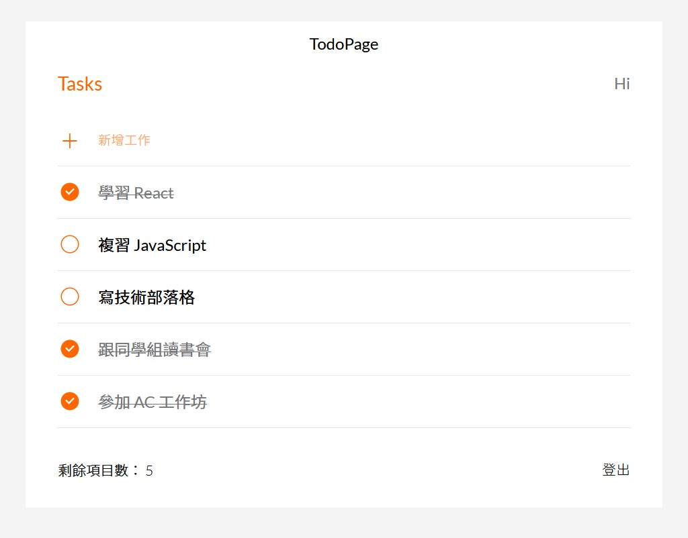

# Todo List - React

## 💡 Overview 介紹

AC 前端 React 練習。使用 React 開發。

### 👀 頁面截圖



## ⚙️ Features 功能

- 使用者可以新增、編輯、刪除 todo

## 🚀 Getting Started 開始使用

⚠️ **請先確認電腦中已安裝 node.js 與 npm！**

1. 將專案 clone 到本地：

```bash
$ git clone "https://github.com/KellyCHI22/todolist-react.git"
```

2. 在本地開啟之後，透過終端機進入資料夾，輸入：

```bash
$ npm install
```

3. 安裝完畢後，繼續輸入：

```bash
$ npm run start
```

4. 打開瀏覽器輸入網址：`http://localhost:3000` 即可進入網站

5. 若要暫停使用，可在終端機入入以下指令：

```bash
ctrl + c
```
